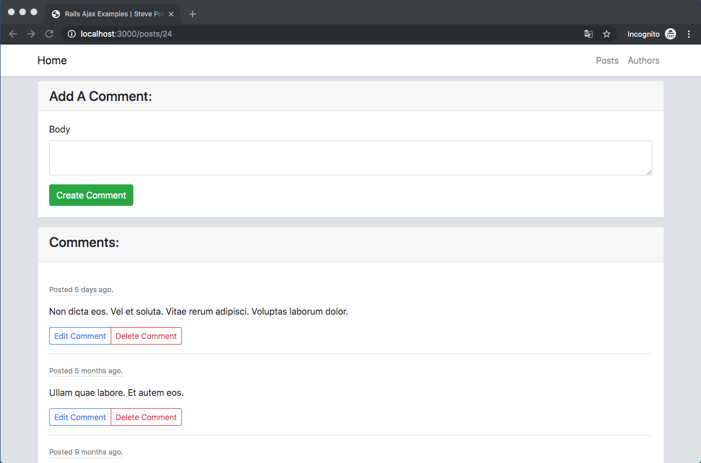
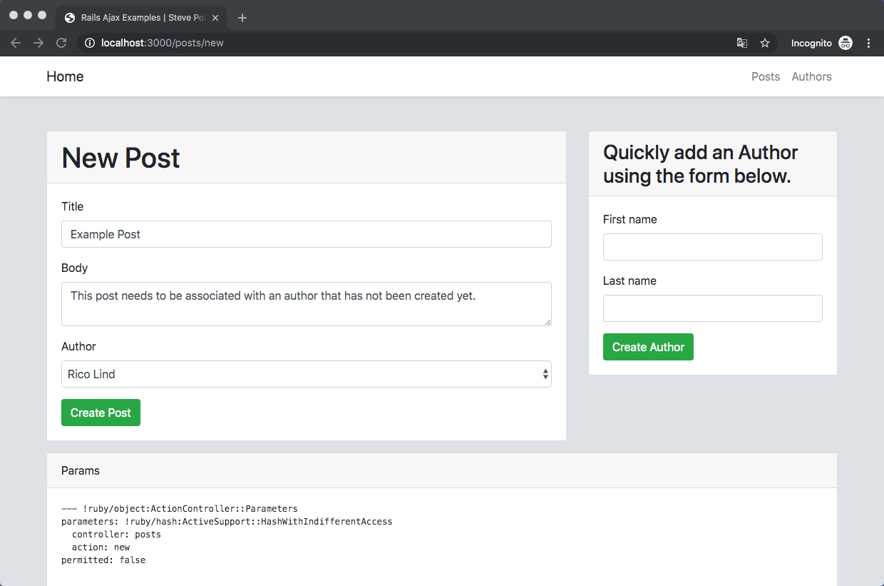

# Rails AJAX Examples

Rails ships with [turbolinks](https://github.com/turbolinks/turbolinks) which:

> automatically fetches the page, swaps in its `<body>`, and merges its `<head>`, all without incurring the cost of a full page load.

This creates a reactive, fast application. However, there are times when `turbolinks` is not enough, and you'll want to roll your own AJAX solutions.

## Blueprint

Below is a generic blueprint to follow when implementing AJAX on the `create` action of a model in a Rails application.

### 1: Controller

Create a `respond_to` block and make sure to pass `format.js` in the block. This will automatically render a corresponding `create.js.erb` file. This file needs to be manually created in the corresponding `views` directory.

```
  def create
    @your_model = YourModel.create(your_model_params)
      respond_to do |format|
          if  @your_model.save
              # This will run the code in `app/views/your_model/create.js.erb`.
              format.js
          else
              # This will run the code in `app/views/your_model/create.js.erb`.
              format.js
          end
      end
  end
```

### 2: Form

Make sure your form does not use `local: true`. Otherwise, the form will not submit remotely.

```
<%= form_with model:@your_model do |f| %>
  ...
<% end  %>
```

### 3: Create View

Handle errors and successful model creations with Javascript in your corresponding `app/views/your_model/create.js.erb` file.

```
# app/views/your_model/create.js.erb
<% if @your_model.errors.any? %>
  # Handle errors
<% else %>
  # Handle save
<% end %>
```

## Example 1: Adding Comments Asynchronously



## Example 2: Adding Authors Asynchronously 



---

# Set Up

1. `bundle install`
2. `rails db:setup`
3. `rails s`

# Notes

To see notes that specifically pertain to the examples, run the following commands.

1. `rails notes -a="NOTE COMMENT"` or `rails notes -a="NOTE AUTHOR"`

To see all notes, run the following command.

1. `rails notes -a="NOTE"`

# Tests

Because the application is testing AJAX, you'll need to have [Selenium Driver](https://github.com/teamcapybara/capybara#selenium) installed.

1. `rspec`


# Specs

1. `rspec -f d`